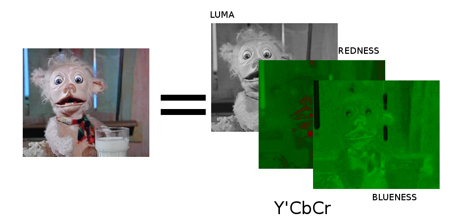
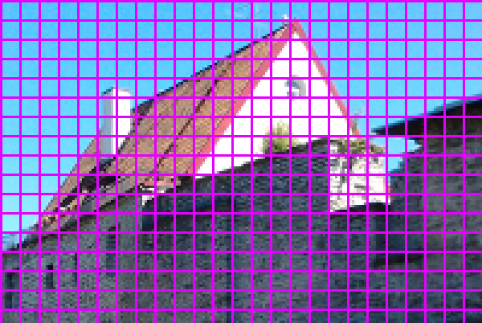
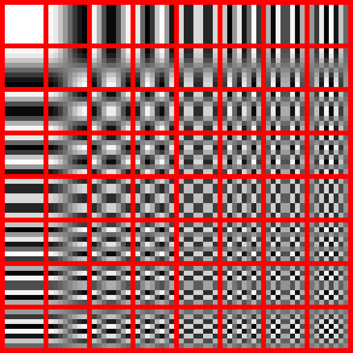
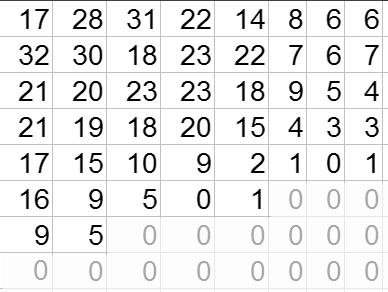
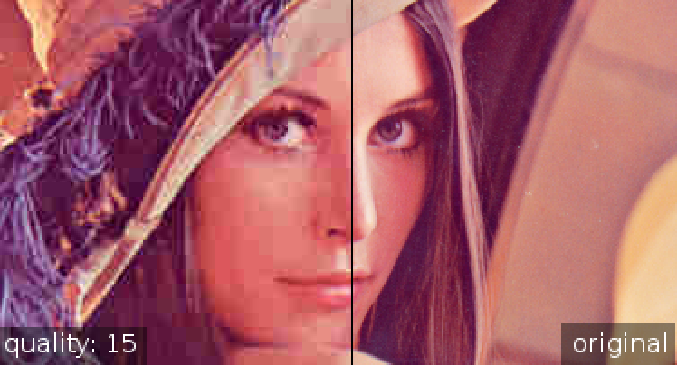
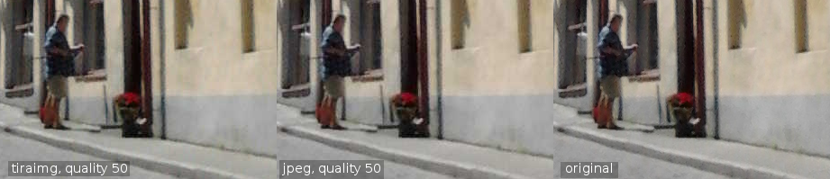

% tiraimg: JPEG-pakkauksen sukulainen
% Pekka Väänänen
% June 12, 2013

<!---
Compile to a standalone presentation with pandoc -t slidy --self-contained -s source.md -o tiraimg_slides.html
-->

# Yleistä

- *tiraimg*: JPEG-klooni
	- ei tallenna standardoituun JFIF-tiedostoon
	- kuitenkin algoritmi on lähes sama

- syöte -> DCT -> RLE -> Huffman-koodaus -> lopputulos

 

# Väriavaruusmuunnos

 

# Miksi väriavaruusmuunnos
- Kirkkausinformaatio tärkeämpää kuin värit
	- värit siis tallennetaan heikommalla laadulla

- tiraimgin tapauksessa heikensi pakkausta

# Kuvan jako ruutuihin
- muunnoksen ei tarvitse prosessoida koko kuvaa
	- kyseinen DCT toteutus on O(n^2)
	- skaalautuu paremmin 
	- näyttää ihan kivalta

 

# Asian ydin: DCT
- Diskreetti kosinimuunnos
- signaali (= kuvadata) esitetään kosinien summana
- 8x8 px ruutu esitetään pysty- ja vaakataajuuksien yhdistelmänä
- tallennetaan eri taajuksien kertoimet
	- vievät saman verran tilaa kuin pikselit

 

# Häviöllisyys
- kertoimet kvantisoidaan jakamalla ne jollain luvulla
	- jakamisessa syntyneet nollat jätetään pois

 

- -> häviöllinen pakkaus!

# Pakkausta
 

# RLE
- Run-length encoding
- Tavujonot korvataan tiiviimmällä kuvauksella

## Esim.
- 0xAA 0xAA 0xAA 0xAA --> 0x04 0xAA

## ZRL, melkein kuin RLE
- pakataan ainoastaan nollatavujonot
- tässä tapauksessa ainoastaan ruudun loppuosa

# Huffman-koodaus
- Korvataan yleisimmin esiintyvät tavut lyhyemmillä bittiesityksillä

- 0xAA = 010, 0x45 = 1000
- 010 010 010 1000 010 010 010 
	- 7 tavua, kuitenkin vain 22 bittiä

- häviötön

# Esimerkki
## iso_katu.ppm
- pakkaamaton PPM-kuva 
	- 9 437 240 tavua = 9.0 MB
- jpg (quality 50, 2x2 chroma subsampling)  
	- 196 024 tavua = 191.4 KB
- tiraimg (quality 50)
	- 592 356 tavua = 578 KB

 

# Lähteet
- dctjpeg.png http://upload.wikimedia.org/wikipedia/commons/2/23/Dctjpeg.png
